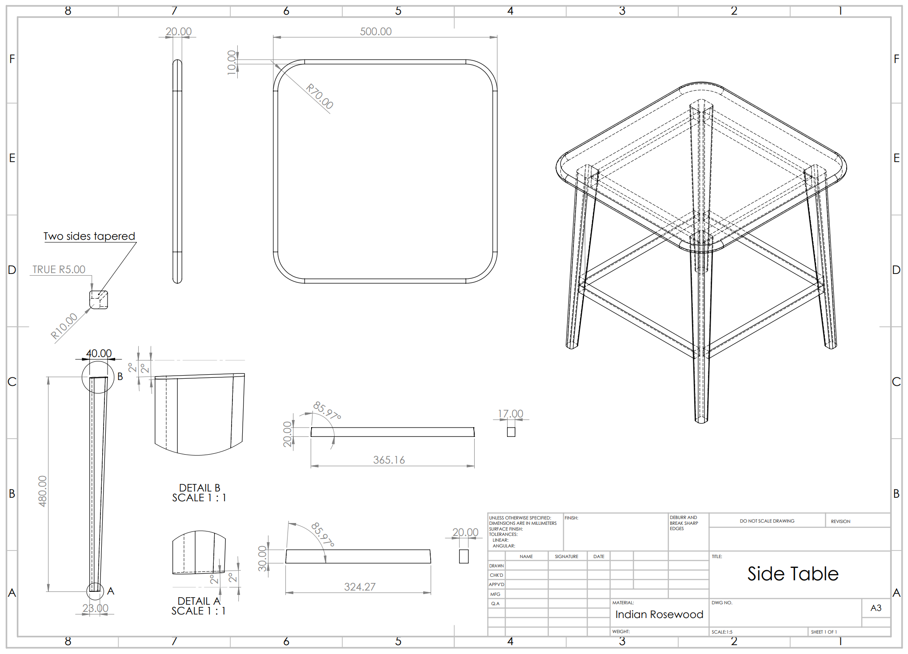

I designed this Indian rosewood side table with mid-century modern style in mind. The legs, which have both a taper and a slight splay, presented an interesting challenge, and needed to be cut with a custom-made jig on the table saw.

I modelled the table in Solidworks and prepared a technical drawing to specify the correct angles for the legs.